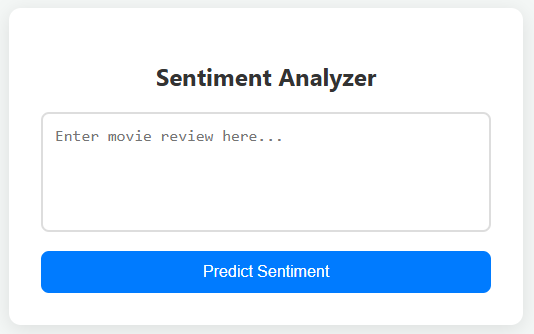
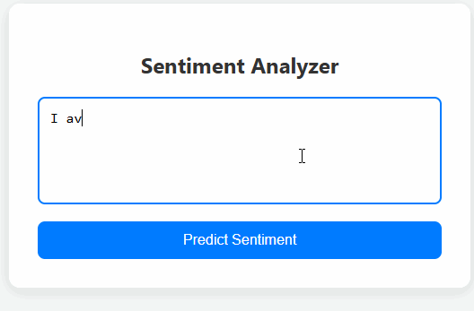

# IMDB Movie Review Sentiment Analysis Web App

A Flask web application that predicts the sentiment (Positive/Negative) of IMDB movie reviews in real-time using a trained Logistic Regression model.

---

## Project Structure

```

Movie review sentiment analysis/
│
├── Data/
│   ├── Raw/
│   │   └── IMDB Dataset.csv
│   └── processed_data/
│       └── cleaned_reviews.csv
│
├── Models/
│   ├── logistic_model.joblib
│   ├── tfidf_vectorizer.joblib
│   └── label_encoder.joblib
│
├── my_app/
│   ├── my_templates/
│   │   └── index.html
│   ├── static/
│   │   ├── screenshot.png
│   │   └── demo.gif
│   └── app.py
│
├── notebooks/
│   ├── 01_understanding_data.ipynb
│   ├── 02_preprocessing_data.ipynb
│   ├── 03_eda-visualization.ipynb
│   ├── 04_model_training.ipynb
│   └── 05_model_evaluation.ipynb
│
└── requirements.txt

````

---

## Features

- Predicts **Positive** or **Negative** sentiment from IMDB movie reviews.
- Real-time prediction via **Flask web interface**.
- Clean and responsive **UI using HTML, CSS, and JavaScript**.
- Uses **TF-IDF vectorizer** and **Logistic Regression** model for prediction.
- Shows a loading animation while processing user input.
- Handles both short sentences and long paragraphs.

---

## App Preview

### Screenshot


### Demo GIF


---

## Installation

1. **Clone the repository**

```bash
git clone <your-repo-url>
cd "Movie review sentiment analysis"
````

2. **Install dependencies**

```bash
pip install -r requirements.txt
```

> If `requirements.txt` is not present, create it with:

```
Flask==2.3.2
scikit-learn==1.3.0
pandas==2.1.1
numpy==1.27.5
joblib==1.3.2
nltk==3.9.1
```

3. **Download NLTK stopwords and WordNet** (if running preprocessing)

```python
import nltk
nltk.download('stopwords')
nltk.download('wordnet')
```

---

## Running the App

1. Navigate to the `my_app/` folder:

```bash
cd my_app
```

2. Run Flask:

```bash
python app.py
```

3. Open your browser and go to:

```
http://127.0.0.1:5000
```

4. Enter a movie review and click **Predict Sentiment** to see the result.

---

## Usage Examples

### Positive Review

* "I absolutely loved this movie! The acting was superb and the story kept me hooked till the very end." → **Positive**

### Negative Review

* "This was a waste of time. Poor acting, terrible script, and completely unoriginal plot." → **Negative**

---

## Model Details

* **Model:** Logistic Regression
* **Vectorizer:** TF-IDF (max_features=5000, ngram_range=(1,2))
* **Label Encoder:** Encodes `positive` → 1, `negative` → 0
* **Test Accuracy:** 90.8%
* **ROC-AUC:** 0.96

---

## Contributing

1. Fork the repository.
2. Make your changes in a separate branch.
3. Submit a Pull Request for review.

---

## License

This project is licensed under the MIT License.

---

## Contact

**Md. Maruf**
Email: [maruf.md1727@example.com](mailto:maruf.md1727@example.com)
GitHub: [github.com/Md-Maruf-1727](https://github.com/Md-Maruf-1727)

```

---


